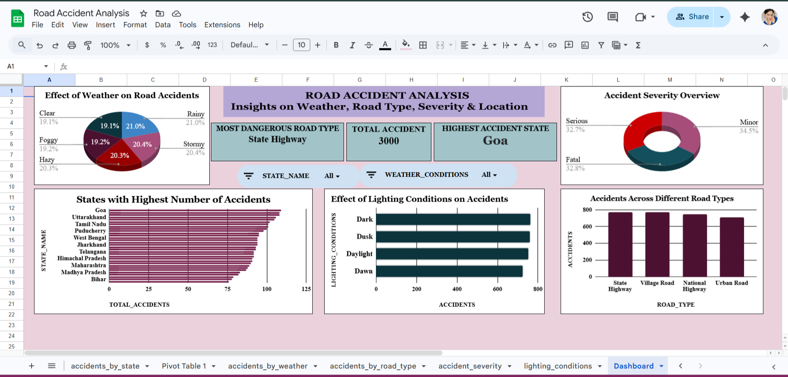

#  Road Accident Analysis Dashboard – India

##  Project Overview

Road accidents remain a major public safety concern across India.
This project analyzes accident data to identify high-risk locations, environmental factors, and accident severity patterns using **SQL-based analysis and interactive dashboard visualization**.

The objective is to transform raw accident data into actionable insights that can support **data-driven road safety decisions**.

---

##  Business Problem

Transportation authorities require analytical insights to:

* Identify accident-prone regions
* Understand environmental and road-related risk factors
* Improve safety planning and infrastructure decisions

This project simulates a real-world data analyst workflow used in transportation analytics.

---

##  Project Objectives

* Analyze accident distribution across Indian states
* Evaluate impact of weather conditions on accidents
* Study accident severity trends
* Compare accidents across different road types
* Understand lighting conditions contributing to accidents

---

## 🛠 Tools & Technologies

- **SQL** – Data extraction, filtering, and aggregation
- **Python**

  - **NumPy** – Numerical computations
  - **Pandas** – Data cleaning & analysis
  - **Matplotlib** – Data visualization
  - **Seaborn** – Statistical visualizations
    
- **Microsoft Excel / Google Sheets** – Interactive dashboard creation
- **Data Visualization & Analytical Reporting**

---

## Project Workflow

Dataset → Data Cleaning → SQL Analysis → Dashboard Creation → Insights → Recommendations

---

## Dashboard Preview

---

## Repository Structure

road-accident-analysis-india
 -data/            # Raw dataset
 -sql/             # SQL analysis queries
 -dashboard/       # Final dashboard file
 -images/          # Dashboard screenshots
 -data_cleaning.md
 -sql_analysis.md
 -requirements.txt
 -README.md

---

##  Key Insights

* **State Highways** recorded the highest accident frequency.
* **Goa** emerged as the state with the highest accident count.
* **Minor accidents** constitute the majority of reported incidents.
* Poor **lighting conditions (Dark/Dusk)** significantly increase accident risk.
* Weather conditions show noticeable influence on accident occurrence.

---

##  Business Recommendations

* Improve road lighting infrastructure in accident-prone regions.
* Increase monitoring and traffic enforcement on State Highways.
* Implement weather-based road safety alerts.
* Deploy emergency response units in high-risk states.
* Conduct targeted driver awareness programs.

---

##  How to Use This Project

1. Download the dataset from `/data`
2. Execute SQL queries available in `/sql`
3. Open dashboard file inside `/dashboard`
4. Explore interactive insights

---

##  Skills Demonstrated

* Data Cleaning & Preparation
* Exploratory Data Analysis (EDA)
* SQL Aggregations & Grouping
* Data Visualization & Dashboard Design
* Insight Generation & Business Storytelling

---

##  Author

**Anshika Goel**
Aspiring Data Analyst

## ⭐ If you found this project useful, consider giving it a star!
